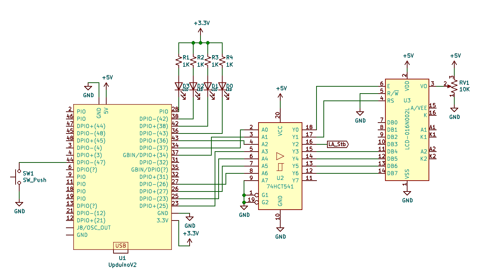
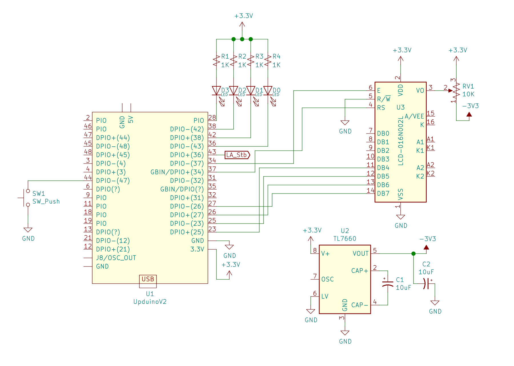

# FPGA_HD44780
Simple, write-only character LCD core in 4-bit mode. Intended for use in debugging but would work as a display library.

## work in progress. 

## and yeah I will make a new project cleaning all this up bc this one is a mess. it's an "early work."

### Maybe instead of wishbone try [Pipelines approach](https://davidthings.github.io/spokefpga/pipelines)

-----

This is a project I'm using to teach myself programmable logic, so I don't (yet) recommend using it. As of this writing on 10/22/19, [it can initialize the LCD and write a test message!](https://github.com/SamWibatt/FPGA_HD44780/wiki/Goal-5-Hello,-%E3%83%88%E3%83%88%E3%83%AD#it-works) And has the capacity to render other text and use all HD44780 commands (as far as I know!) I'm making the project public so anyone interested can see the process I'm going through for design, as well as my current skill level.

### The [project wiki](https://github.com/SamWibatt/FPGA_HD44780/wiki) is a development diary

# overview

* platform: [Gnarly Grey Upduino V2.0](https://github.com/gtjennings1/UPDuino_v2_0) - [Sold here](http://www.gnarlygrey.com/)
* toolchain: Icestorm - [github](https://github.com/cliffordwolf/icestorm), [home page](http://www.clifford.at/icestorm/)
    * iverilog
    * yosys
    * nextpnr
    * gtkwave
    * verilator (planned - nothing implemented yet)
* dev system: Ubuntu 18.04 laptop
* Logic analyzer: [Inno-maker LA1010 16ch 100MHz](http://www.inno-maker.com/product/usb-logic-analyzer/) - [also at Amazon](https://smile.amazon.com/gp/product/B07D21GG6J/)

Here shown with some extraneous stuff on the breadboards - in the upper left, a couple of micro-usb breakouts I may use for supplying 5V to other circuits, plus a couple rows of header pins not connected to anything; lower left, a Lattice iceStick evaluation board and a little homemade power supply and 74HCT541 level shifter (which I may use instead of the USB breakouts and the separate HCT541.) The circuit itself is the UpduinoV2 in the upper right, the LEDs and HCT541 in the middle of the upper breadboard, plus the contrast potentiometer and LCD display itself in the lower right.

## test circuit schematic

Here is the test circuit shown above. The UpduinoV2 is based on [the Upduino V2.0 Cheat Sheet by Matt Mets @cibomahto](https://github.com/cibomahto/upduino/blob/master/upduino_v2.0_pinout.png), from which I made a KiCad part - which is not currently and may never be suitable for use in creating circuit boards; I just made it for schematics like this, and laid it out so that the pins are in the same relative positions that they are on the real board. Not the custom with schematic symbols but I think this will help people see how to wire it up (I suppose I should learn Fritzing if I want to make wiring diagrams.)

**Note:** One complication in interfacing a character LCD to the Upduino V2 is that the FPGA uses 3.3V logic levels and the displays (typically) 5V. I got around that by using a 74HCT541.

If you're not familiar with the 74HCT541, all it does is to buffer logic signals. That is, the input at A0 is repeated at Y0, A1 to Y1, etc. They're intended for cases where the input signals can't drive much current and have to drive several logic inputs (the output still isn't lots of current, in terms of driving LEDs or motors or anything.)

They're handy for interfacing 3.3V logic to 5V logic - if you power the HCT541 with 5V, it happens that a "high" 3.3V input at Ai appears as a 5V high on Yi. Only one direction, though, you can't turn a 5v input back into 3.3v. which is ok for this circuit because all the signals only go one way. Used in this manner the HCT541 is acting as a "level shifter."

Also, the particular pin you use for a signal isn't important, as long as the correct FPGA pin ultimately connects to the correct LCD pin. For instance, pin 34 of the Upduino V2 must connect to pin 6 of the LCD through one of the Ai/Yi pairs on the HCT541, but it could be any of A0/Y0 - A7/Y7. Arrange it in whatever way is convenient (the test circuit pictured above uses different buffers than the schematic.)

It's also sort of within spec to use the 3.3V logic signals as direct inputs, with no level shifting, to the LCD logic pins when the LCD is powered with 5V. The tolerances are too close for my peace of mind but I won't come to your lab and stop you from trying it.

It is possible to run the LCD with a 3.3V supply, but that requires that the contrast voltage at the display's pin 3 have a negative voltage applied. For the first attempt I wired it up according to what I had on hand and understood. One advantage of doing it with the 3.3V logic supply and negative contrast voltage is that you could use the bidirectional bus mode on the LCD and check for its "busy" flag instead of waiting for minimum processing times to elapse; busy flag version is out of scope for this project.

It turns out to be pretty easy to create the negative voltage with a [TI TL7660 Negative Voltage Converter (pdf datasheet linked)](http://www.ti.com/lit/ds/symlink/tl7660.pdf) or equivalent. The chip itself is $1.55 in single quantity from Digi-Key and two small cheap 10uF/16V electrolytics should be plenty for this use. 

Here is the schematic for the 3.3V / -3.3V version. **NOTE CAREFULLY the orientation of C2; ground is the positive side.**

## building the test

`./build.sh hello` should yield a hd44780_hello.bin after a great deal of yosys console output.

`iceprog hd44780_hello.bin` sends it to the Upduino v2. 

## operation

* On powerup, the RGB LED on the upduino v2 board should start stepping through different colors, and the LCD should show the black bars that character LCDs show on powerup. 
    * You can adjust the potentiometer RV1 at this point to get the contrast right.
    * If nothing shows on the LCD, it may be the contrast is wrong; if you run the contrast potentiometer all the way through its range and nothing ever shows, there's trouble of some sort. 
    * The display I used is an old one. I tested it with an Arduino Uno and [a tiny tweak to the Arduino LiquidCrystal library's "hello" example](https://github.com/SamWibatt/FPGA_HD44780/blob/master/arduino/HelloWorld20x4/HelloWorld20x4.ino). I recommend doing something similar if you've not used character LCDs before; it's a much easier way to work with them.
* When you press the button, the circuit will go through LCD initialization and render the Hello, トトロ message.
* The off-board LEDs D0-D3 are status lights that show the circuit has reached certain stages in execution.
    * all are active low, all should be off when the circuit is powered up.
    * D0 lights when the button is pressed
    * D1 when the 100ms initial delay has elapsed
    * D2 after LCD initialization script has completed
    * D3 after sample text rendered.
    * this way, you can tell how far the test circuit *thinks* it's gotten. 
* LA_Stb is a strobe out to logic analyzer to trigger capture.
    * It is raised after the button is pressed and the 100ms post-power-on delay has elapsed. That way, the logic analyzer doesn't have to record 100ms' worth of cycles before getting to the interesting stuff.
* The LEDs and LA_stb are not necessary to the LCD controller module's operation.
     * They're not in the module itself, just in the "hello" test framework

## what it does

This set of modules comprises a **very** special-purpose 'computer' that can step through a list of instructions in RAM and execute them.

The instructions consist of 1 or 2 4-bit quantities to be sent to the LCD module, plus register select signal, and a length of time to delay after sending. 

The idea is that FPGA RAM can be preloaded with sets of instructions for initializing the LCD module, rendering literal strings, and so on, then the hd44780_controller module used to interpret them and drive the LCD.

Instruction format documented [in the project wiki](https://github.com/SamWibatt/FPGA_HD44780/wiki/RAM-entry-format-for-controller).

## creating your own "scripts"

**HERE WRITE UP THE TOOL THAT LETS YOU CREATE .MEM FILES BUT I HAVEN'T WRITTEN IT YET**

## acknowledgements

* I am indebted to Donald Weiman for the [LCD Initialization page (4 bit section)](http://web.alfredstate.edu/faculty/weimandn/lcd/lcd_initialization/lcd_initialization_index.html). That page is Copyright © 2009, 2010, 2012 Donald Weiman     (weimandn@alfredstate.edu), licensed under the Creative Commons Attribution-ShareAlike License.   To view a copy of this license, visit http://creativecommons.org/licenses/by-sa/3.0/
* I am **hugely** indebted to Dr. Dan Gisselquist whose [Gisselquist Techonolgy, LLC page](https://zipcpu.com/) includes a wealth of information for the beginning (and expert!) FPGA designer. In particular, his [brief page on FPGA Hell](https://zipcpu.com/blog/2017/05/19/fpga-hell.html) verified that as it is with microcontroller programming, so it is with FPGA development: be sure you have visibility into what your circuit does lest you be stuck with an unresponsive chip and no way to tell what went wrong. The FPGA Hell page links to further information about how to get that visibility. While I haven't learned all the techniques Dr. Gisselquist recommends yet, simulating in GTKWave and using [LED "blinkies" - see the section on using Blinky for debugging](https://zipcpu.com/blog/2017/05/19/blinky.html) was enough to get me through this project. I used more LEDs.
* Unending props to Clifford Wolf's [Project Icestorm](http://www.clifford.at/icestorm/), which inspired me to finally take the plunge and start investigating FPGA development in the first place. I'm a giant fan of open source tools and Icestorm was just what I was looking for.
* Thanks also to [osresearch's up5k github repo](https://github.com/osresearch/up5k), which has some straightforward demystification of developing for the Upduino V2 using icestorm.

