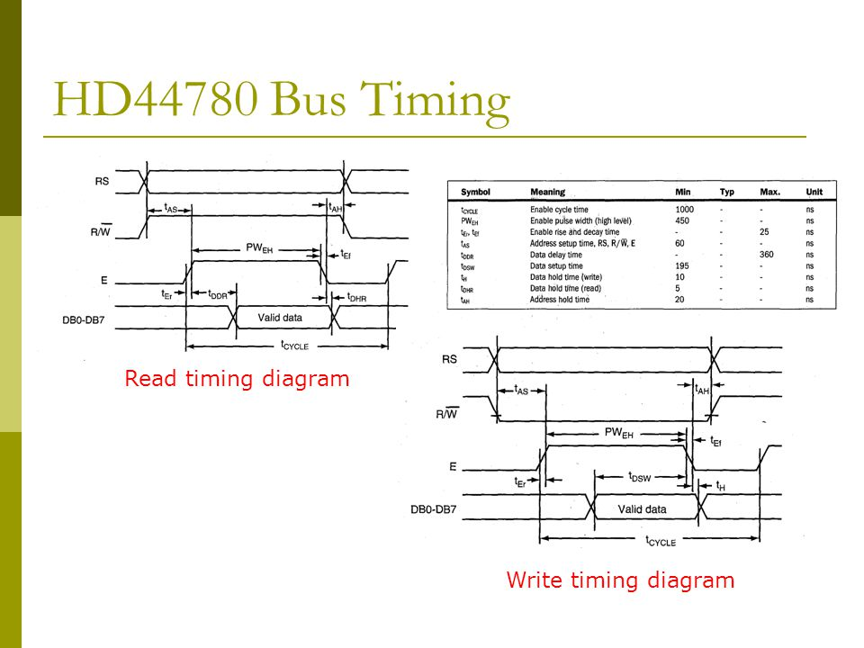

# FPGA_HD44780
Simple, write-only character LCD core

### from FPGA AI Notes:
* WY NOT WRITE A HD44780 CORE with wishbone interface?
    * That is a thing I have my own sources for in assembly, and am capable of writing in gateware.
    * Also a decent candidate for Verilator? Esp if I roped in ncurses and did the display lol
    * no lol, that is a great idea. Tho maybe need to do it with a grx thing because of special characters.
    * If you really wanted to grit your teeth over it, need to do all the fiddly timings.
    * and I suppose I need to get thinking of all this in terms thereof.
    * So… maybe the way to prove an LCD interface is to prove that
Signals coming in are within min/max time for whatever event
e.g. enable pulse coming in too soon after data lines set = bad
signals come in in a sensible order, like… address before data, or wev
both at nybble and individual-signal level
that's the idea
    * also prove the Wishbone interface, crib from Dr. G
    * What is a minimum viable verilator LCD?
    * hm, look at the interface
    * At first just support 4-bit, can do 8-bit later
    * saved hd44780 datasheet to FPGA/charLCD
    * And some good images Esp one from https://slideplayer.com/slide/3942627/ 
    
    * Verify timing w sheet, figure out how to tell if the driver violates. Let's only do write, first
    * and **only write ever** BC level shifter to 5 v
    * So assert that my driver never sends R/~W low, at least while enable is high
    * Look into hct541 prop delay - worst case is 29ns, typ 13ns
    * Doubt it matters.
    * Also LCD first, wishbone later.
    * Wishbone Blinky to get that sorted out, then merge with this LCD.
    * Can wishbone 32 bus have a wishbone 8 student?
